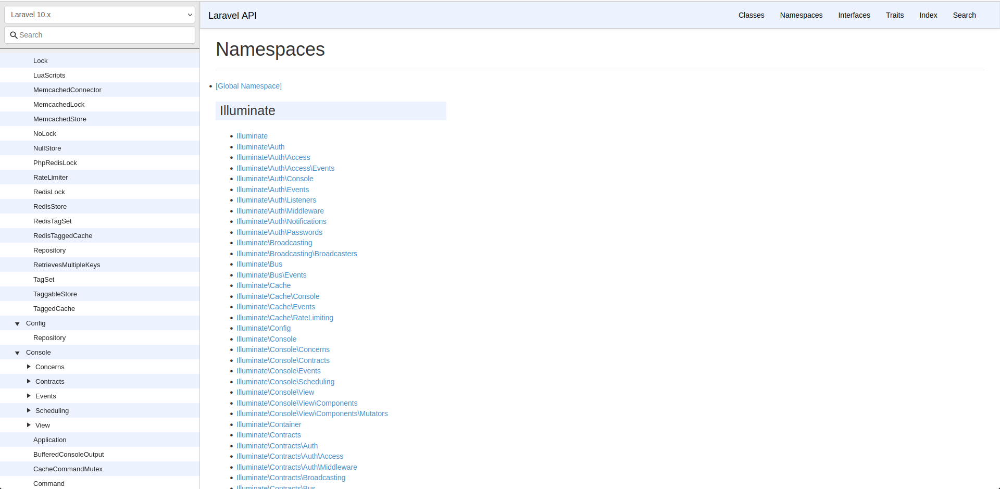

# Final Thoughts
 

## Follow community accepted:
- patterns
- folder structure
- code formatting
 

## Embrace framework don't fight it
- repositories
- command bus pattern
- microservices
- DDD - domain driven design
 

## Explore
- do browse laravel core files and even put `dd()` inside them
- do browse other's devs packages e.g. [Spatie](https://spatie.be/open-source?search=&sort=-downloads)
- [Laravel API](https://laravel.com/api/10.x/)
    - docs of all Laravel related files

 

## Learn, Improve, Code
- [Laracast](https://laracasts.com/)
- [Laravel Daily](https://laraveldaily.com/)
- [Test Driven Laravel](https://course.testdrivenlaravel.com/)
- [Jason McCreary](https://jasonmccreary.me/)
- [Laravel News](https://laravel-news.com/)
- [List of my favourites talks](https://jcergolj.me.uk/12-laravel-must-watch-talks)

[Next](https://github.com/jcergolj/my-laravel-adventure/blob/master/0.intro.md)
