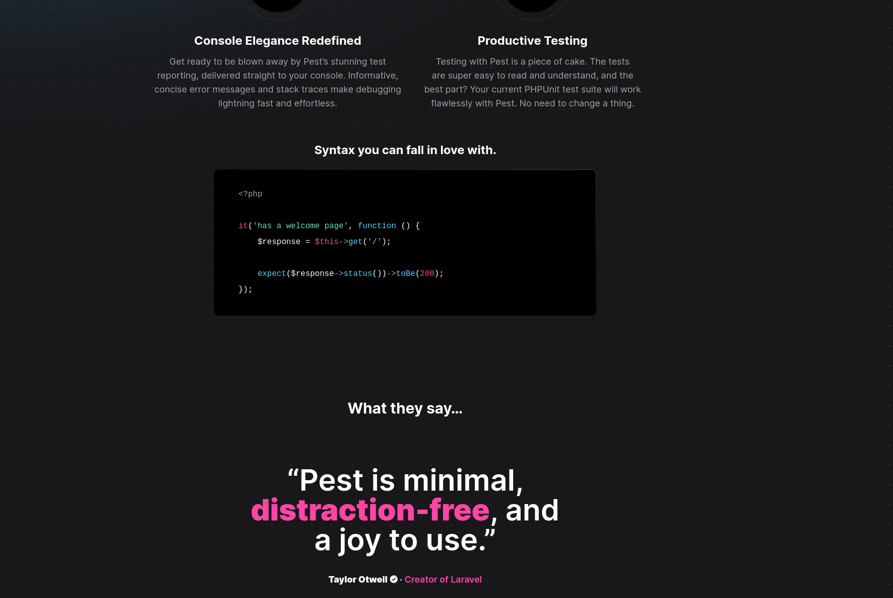

# Testing
<br/>

## [PEST](https://pestphp.com)

<br/>

##  Feature & Unit tests
- my preferred approach is `outside in`
- `controllers` and `commands` tests in `Feature` folder
- everything else into `Unit` folder
- namespace of controllers and commands classes matches namespace in test classes
- if test class gets too bloated you can split it into several test classes
    <br/>
  `App\Feature\Http\Controllers\PostController\IndexTest`
- test properties
- preventStrayRequests
<br/>

## How I test
```php
<?php

namespace Tests\Feature\Http\Controllers;

use App\Http\Controllers\PostController;
use App\Http\Requests\StorePostRequest;
use App\Models\Post;
use Illuminate\Support\Facades\Http;
use Jcergolj\FormRequestAssertions\TestableFormRequest;
use Tests\TestCase;

/** @see \App\Http\Controllers\PostController */
class PostControllerTest extends TestCase
{
    use TestableFormRequest;

    /** @var Post */
    protected $post;

    public function setUp(): void
    {
        parent::setUp();

        // error is thrown if an actual API call is made
        Http::preventStrayRequests();

        $this->post = Post::factory()->create(['status' => PostStatuses::Published]);
    }

    /** @test */
    function pending_posts_are_not_visible()
    {
        $this->post = $this->post->update(['status' => PostStatuses::Pending]);

        // ...
    }

    /** @test */
    function assert_http_api_request()
    {
        Http::fake([
            'fake_api_call_1' => Http::response([], 200)
            'fake_api_call_2' => Http::response([], 200)
        ]);

        $this->post('post/create');

        Http::assertSendInOrder([
            $this->assertPostApiCall1Request();
            $this->assertPostApiCall2Request();
        ]);
    }

    public function controller_has_form_request()
    {
        // first option
        $this->assertActionUsesFormRequest(PostController::class, 'store', StorePostRequest::class);

        // second option
        $this->post('/posts');
        $this->assertContainsFormRequest(StorePostRequest::class);
    }

    protected function assertPostApiCall1Request()
    {
        return function (Request $request) {
            $this->assertSame('fake_api_call_1', $request->url());

            $this->assertSame('POST', $request->method());

            $this->assertSame([], $request->data());

            // return 'fake_api_call_1' === $request->url() && 'POST' === $request->method() && [] === $request->data(); don't
            return true;
        };
    }

    protected function assertPostApiCall2Request()
    {
        return function (Request $request) {
            $this->assertSame('fake_api_call_2', $request->url());

            $this->assertSame('GET', $request->method());

            $this->assertSame([], $request->data());

            $this->assertSame($this->post->status, $request->data()['post_status'])
            // return 'fake_api_call_2' === $request->url() && 'GET' === $request->method() && [] === $request->data(); don't

            return true;
        };
    }
}
```
- install package `composer require --dev jcergolj/laravel-form-request-assertions`
- use `TestableFormRequest`
- create unit test `StorePostRequestTest` class

```php
<?php

namespace Tests\Unit\Http\Requests;

use App\Http\Requests\StorePostRequest;
use Jcergolj\FormRequestAssertions\TestableFormRequest;
use Tests\TestCase;

/** @see \App\Http\Requests\StorePostRequest */
class StorePostRequestTest extends TestCase
{
    use TestableFormRequest;

    /** @test */
    public function pass()
    {
        $user = User::factory()
            ->has(Token::factory()->adminGenerated()->count(1))
            ->create();

        Auth::login($user);

        $this->createFormRequest(StorePostRequest::class)
            ->by($user)
            ->validate([
                'email' => 'joe@example.com',
            ])
            ->assertPasses();
    }

    /**
     * @test
     *
     * @dataProvider validationFailsProvider
     *
     * @param  mixed  $name
     * @param  mixed  $value
     * @param  mixed  $rule
     */
    public function fails($name, $value, $rule)
    {
        $this->createFormRequest(StorePostRequest::class)
            ->validate([$name => $value])
            ->assertFails([$name => $rule]);
    }

    public static function validationFailsProvider()
    {
        return [
            'Email is required rule failed.' => ['email', '', 'required'],
            'Email must be valid email address.' => ['email', '', 'email'],
            // 'Tag max char length 255' => ['tag', Str::random(256), 'between:4,255'],
            // 'Tag min char length 4' => ['tag', Str::random(3), 'between:4,255'],
        ];
    }

    /** @test */
    public function prepare_for_validation()
    {
        $request = new StorePostRequest([
            'email' => ' Joe.Doe@example.com  ',
        ]);

        $request->prepareForValidation();

        $this->assertSame('joe.doe@example.com', $request->email);
    }

    /** @test */
    public function request_is_allowed_for_all()
    {
        // do we really need it?
        $request = new StorePostRequest();
        $this->assertTrue($request->authorize());
    }
}
```
<br/>

## [Laravel Dusk](https://laravel.com/docs/10.x/dusk)
- browser automation and testing API
- simulating user with API
- end-to-end testing
- e.g. to test payments, critical user interactions
[Next](https://github.com/jcergolj/my-laravel-adventure/blob/master/7.providers.md)
